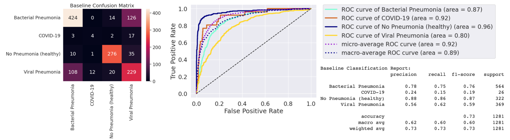
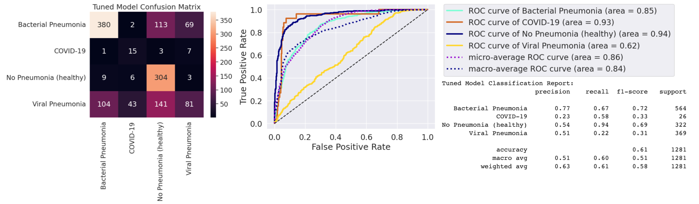
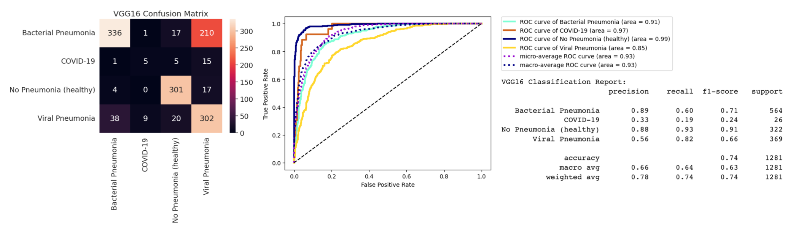
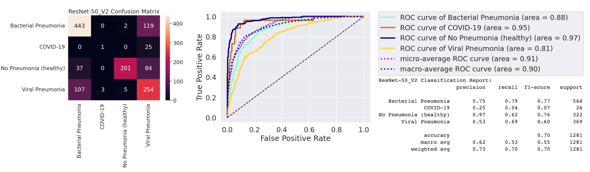

# X-ray Multi Class Classification
The objective of the project was to classify images into four categories: 'Bacterial Pneumonia', 'Viral Pneumonia', 'No Pneumonia (healthy)', and 'COVID-19'. Our work involved creating a baseline model after exploratory data analysis (EDA) and data preprocessing. Subsequently, we performed experiments involving hyperparameter tuning, including dropout layers, optimizers, and regularizations. Additionally, we explored the effectiveness of transfer learning models to compare their performance. The evaluation metrics employed encompassed confusion matrices, F1 scores, and ROC curves.

## Table of contents
* [General info](#General-info)
* [Dataset](#Dataset)
* [Method](#Method)
* [Implementation](#Implementation)
* [Conclusion](#Findings-and-conclusion)

## General info
This project was conducted in collaboration with three fellow classmates as part of a deep learning course during my master's studies. Its focus was on developing a deep learning model for classifying cases such as pneumonia and COVID-19 using chest X-ray images.

## Dataset
The COVID-19 X-ray Dataset, containing approximately 6400 chest X-ray images, was obtained from an open-source [repository](https://darwin.v7labs.com/v7-labs/covid-19-chest-x-ray-dataset?sort=priority%3Adesc).
	

## Method	
#### Data preparation, exploration and preprocessing
The dataset was organized into four designated classes based on their labels. Exploration of the data revealed class distribution, indicating an observed class imbalance: 'No Pneumonia (healthy)': 1610, 'Bacterial Pneumonia': 2822, 'Viral Pneumonia': 1846, 'COVID-19': 127.

The dataset was partitioned into Training (60%), Validation (20%), and Test (20%) sets using the stratified method. Images were resized to a uniform size of 156x156 pixels to ensure consistency. Additionally, pixel values were normalized to the range [0, 1] to facilitate model convergence.

#### The baseline model
The baseline model was constructed using TensorFlow's Sequential and Layers functions. The input image size was set at 156x156, with 32 (3x3) filters and padding at each convolutional layer. The training optimizer employed Adaptive Moment Estimation with a categorical cross-entropy loss function and accuracy metrics.

#### Model tuning
Regularization techniques, including dropout layers, optimizers, and regularization, were implemented. The impact of varying learning rates and data augmentation was also explored. Class imbalance was addressed through the use of class weights to assign greater importance to minority classes.

#### Transfer learning
Transfer learning was explored by employing pre-trained models such as VGG16 and ResNet50. Fine-tuning these models on the dataset allowed for a comparison of their performance against our custom-built models.

#### Evaluation metrics
Model evaluation involved metrics such as accuracy, precision, recall, and F1-score. Confusion matrices provided insights into the models' ability to correctly classify images from various classes. ROC curves were employed to assess the models' capacity to distinguish between classes.

## Implementation
Project is created with:
* TensorFlow version: 2.12.0
* Scikit-learn version: 1.2.2
* Google Colab with GPU Acceleration

## Findings and Conclusion
Based on confusion matrices, F1 scores, and ROC curves, it is evident that each model possesses strengths and weaknesses in classifying 'Bacterial Pneumonia', 'COVID-19','Healthy' and 'Viral Pneumonia'.

The Baseline model can predict 'Bacterial Pneumonia' and 'Healthy' with respectable F1 scores (0.76 and 0.87, respectively). However, it struggles to classify 'COVID-19' (F1 score = 0.19). The model's ROC curve area suggests a relatively good discriminative ability for all classes, particularly 'COVID-19' and 'Healthy'. 

The Tuned model displays improved performance in predicting 'COVID-19' (F1 score = 0.33) compared to the baseline model. Nonetheless, its performance is compromised in other classes, particularly 'Viral Pneumonia', where the F1 score sees a significant drop (0.31). ROC curve areas are lower compared to the baseline model across all classes. 

The VGG16 transfer learning model excels in predicting 'Healthy' with an impressive F1 score of 0.91. It boasts the highest ROC curve area for all labels, indicating excellent discriminative capabilities. However, it struggles in predicting 'COVID-19' and 'Viral Pneumonia' (F1 scores = 0.24 and 0.66, respectively). 

The ResNet50V2 transfer learning model demonstrates the best performance in classifying 'Bacterial Pneumonia' with an F1 score of 0.77. It also performs well in predicting 'Healthy' and 'Viral Pneumonia' (F1 scores = 0.76 and 0.6, respectively). However, it performs poorly in classifying 'COVID-19' with a low F1 score of 0.07. 

In conclusion, while no single model is flawless, each has its strengths. For instance, the ResNet50V2 model excels in predicting 'Bacterial Pneumonia', whereas the VGG16 model shines in predicting 'Healthy'. The Tuned model displays potential for 'COVID-19' but requires further refinement due to its complexity. This suggests the need for more sophisticated model improvement or ensemble approaches to effectively address this multi-class classification task. This project also emphasizes that transfer learning can save significant computational resources and time by leveraging pre-trained models, especially when creating a robust model from scratch would demand extensive training and a substantial dataset.

